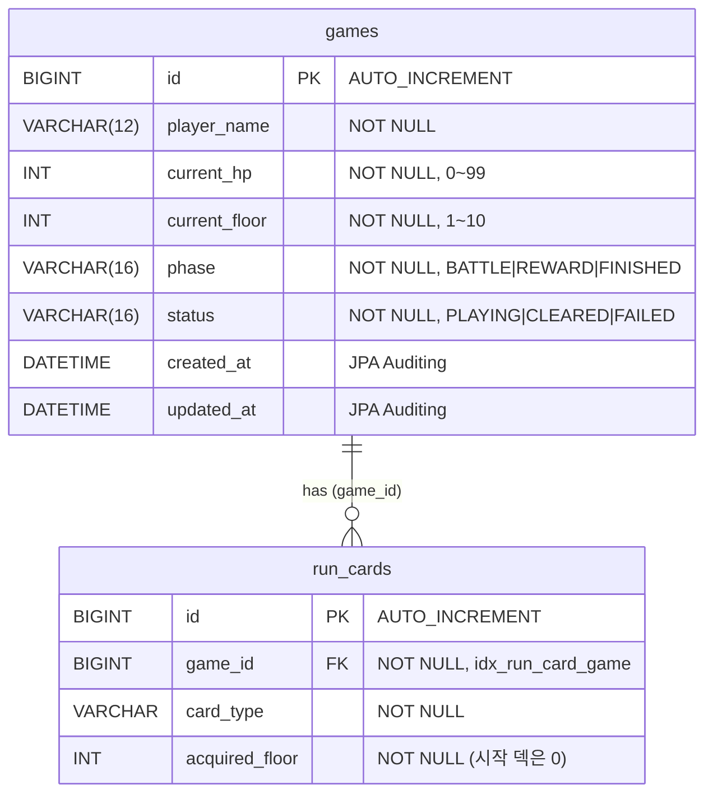

# crimson-citadel — Spring Boot 백엔드 입문 과제

로그라이크 덱빌딩 게임 **crimson-citadel**의 백엔드를 구현하는 Spring Boot 학습용 과제입니다.
완성된 프론트엔드(정적 리소스)가 프로젝트에 포함돼 있어, `src/main/java`의 `TODO`와 비어 있는 DTO를
API 명세대로 채우면 `http://localhost:8080/`에서 게임이 실제로 동작합니다.

- 완성 데모: https://nhahan.github.io/crimson-citadel/
- API 명세: https://f-api.github.io/game-spring-api-docs/basic/api-docs.html
- 단계별 과제 가이드: [`ASSIGNMENT.md`](ASSIGNMENT.md)

## 기술 스택

| 구분 | 내용 |
| --- | --- |
| 언어 | Java 21 (toolchain) |
| 프레임워크 | Spring Boot 4.1.0 — Web MVC, Data JPA, Validation |
| DB | 런타임 **Docker MySQL** / 통합 테스트 인메모리 H2 |
| 빌드 | Gradle (래퍼) |
| 기타 | Lombok, JUnit Platform |

## 실행 방법

```bash
# 1. Docker로 MySQL 실행 (컨테이너 설정에 맞게 application.properties 작성)
docker run --name crimson-mysql -e MYSQL_ROOT_PASSWORD=... -e MYSQL_DATABASE=... -p 3306:3306 -d mysql

# 2. 서버 실행 → http://localhost:8080
./gradlew bootRun

# 테스트 / 빌드
./gradlew test
./gradlew build
```

> `src/main/resources/application.properties`(datasource, `ddl-auto` 등)는 직접 작성합니다.

## 아키텍처

- **3-Layer**: Controller → Service → Repository 로 책임을 분리합니다.
- **엔티티 연관관계는 단방향만** 사용합니다. `cascade`·`orphanRemoval`·양방향 컬렉션을 쓰지 않고,
  자식(`RunCard`)의 조회·저장·삭제는 Repository로 명시적으로 처리합니다.
- 엔티티는 응답으로 직접 노출하지 않고 **DTO로 변환**해 반환합니다.

### 패키지 구조

```
com.gamebasic
├─ game/       # 게임 CRUD·진행 저장  (controller/service/repository/entity/dto)
├─ runcard/    # 게임에 속한 덱 카드   (repository/entity/dto)
├─ ranking/    # 외부 랭킹 API 연동    (controller/service/client/dto)
└─ common/     # 전역 예외 처리·공통 DTO (exception/dto)
```

## ERD

두 테이블만 사용하며, `run_cards`가 `games`를 단방향 `@ManyToOne(LAZY)`으로 참조합니다.



- 새 게임은 `currentHp=99`, `currentFloor=1`, `phase=REWARD`, `status=PLAYING`으로 생성됩니다.
- `status`가 `PLAYING`이 아니면(`isFinished()`) 끝난 게임으로 보고 진행 저장을 막습니다(409).
- 삭제 시 연관 `run_cards`를 먼저 지운 뒤 `games`를 삭제합니다(cascade 미사용).

## API 명세

Base URL: `http://localhost:8080`

| 메서드 | 경로 | 설명 | 성공 | 실패 |
| --- | --- | --- | --- | --- |
| `GET` | `/games` | 게임 목록 조회 (`id` 내림차순, 덱 카드 수 집계 포함) | `200` | — |
| `POST` | `/games` | 게임 생성 (플레이어 이름 + 시작 덱) | `201` | `400` |
| `GET` | `/games/{gameId}` | 게임 상세 조회 (덱 포함) | `200` | `404` |
| `PATCH` | `/games/{gameId}` | 플레이어 이름 변경 (더티 체킹) | `204` | `400` `404` |
| `DELETE` | `/games/{gameId}` | 게임 삭제 (덱 함께 삭제) | `204` | `404` |
| `PUT` | `/games/{gameId}/progress` | 진행 상태·전체 덱 저장 | `200` | `400` `404` `409` |
| `GET` | `/rankings` | 외부 랭킹 API를 가공한 시즌 랭킹 조회 | `200` | — |

### 게임 목록 조회 — `GET /games`

`id` 내림차순 배열. 덱 카드 수(`deckSize`)는 `group by` 집계 한 번으로 구해 N+1을 피합니다.

```json
[
  {
    "id": 2,
    "playerName": "붉은 순례자",
    "currentHp": 0,
    "currentFloor": 7,
    "phase": "FINISHED",
    "status": "FAILED",
    "createdAt": "2026-09-10T12:00:00",
    "updatedAt": "2026-09-10T12:34:00",
    "deckSize": 15
  }
]
```

### 게임 생성 — `POST /games`

요청 검증: `playerName` 2~12자, `deck` 1장 이상. 성공 시 상세 응답(`201`)을 돌려줍니다.

```jsonc
// 요청
{
  "playerName": "밤의 후계자",
  "deck": [
    { "cardType": "STRIKE", "acquiredFloor": 0 },
    { "cardType": "HEART_PIERCE", "acquiredFloor": 0 }
  ]
}
```

### 게임 상세 조회 — `GET /games/{gameId}`

`deck`은 `RunCard`의 `id` 오름차순.

```json
{
  "id": 1,
  "playerName": "밤의 후계자",
  "currentHp": 61,
  "currentFloor": 4,
  "phase": "BATTLE",
  "status": "PLAYING",
  "deck": [
    { "id": 1, "cardType": "STRIKE", "acquiredFloor": 0 },
    { "id": 10, "cardType": "SUNDER", "acquiredFloor": 1 }
  ],
  "createdAt": "2026-09-10T12:00:00",
  "updatedAt": "2026-09-10T12:34:00"
}
```

### 진행 저장 — `PUT /games/{gameId}/progress`

요청의 `deck`은 **저장할 덱 전체**입니다. 서버는 기존 카드를 모두 지우고 요청 순서대로 다시 저장합니다.
끝난 게임(`status`가 `CLEARED`/`FAILED`)에 요청하면 데이터를 바꾸지 않고 `409`를 반환합니다.

```jsonc
// 요청
{
  "currentHp": 55,        // 0~99
  "currentFloor": 5,      // 1~10
  "phase": "REWARD",      // BATTLE | REWARD | FINISHED
  "status": "PLAYING",    // PLAYING | CLEARED | FAILED
  "deck": [ { "cardType": "STRIKE", "acquiredFloor": 0 } ]
}
```

### 이름 변경 — `PATCH /games/{gameId}`

```jsonc
{ "playerName": "새 이름" }   // 2~12자, 204 No Content
```

### 랭킹 조회 — `GET /rankings`

우리 DB가 아니라 [외부 랭킹 API](https://f-api.github.io/game-spring-api-docs/basic/rankings.json)의 시즌 기록을
가공해 만듭니다. 순위 대상(10층 클리어)만 골라 이상 기록을 걸러내고, 클리어 시간 오름차순 →
남은 HP 내림차순 → id 오름차순으로 정렬한 뒤 플레이어당 최상위 1건만 남깁니다.

```json
{
  "season": "2026-09",
  "totalRecords": 610,
  "excludedCount": 42,
  "entries": [
    { "rank": 1, "playerName": "먼상인", "clearTimeSeconds": 300, "remainingHp": 12, "bossTurns": 15, "deckSize": 20 }
  ]
}
```

### 에러 응답

`@RestControllerAdvice`가 `400`/`404`/`409`를 아래 형식으로 통일합니다.

```json
{
  "status": 404,
  "error": "Not Found",
  "message": "게임을 찾을 수 없습니다: 999",
  "path": "/games/999"
}
```

## 과제 단계

필수 Lv1~8, 도전 Lv9~12로 나뉩니다. 각 단계의 목표·확인 방법은 [`ASSIGNMENT.md`](ASSIGNMENT.md)를 참고하세요.

| 단계 | 주제 |
| --- | --- |
| Lv1 | Docker MySQL 연결 설정 |
| Lv2 | 빈 등록(DI) 수정 |
| Lv3 | RESTful 목록 경로 매핑 |
| Lv4 | `@Transactional` 버그 수정 |
| Lv5 | 요청 검증·응답 DTO (게임 생성) |
| Lv6 | 진행·전체 덱 저장 |
| Lv7 | 목록·상세 조회 |
| Lv8 | 이름 변경(더티 체킹)·삭제 |
| Lv9 | 끝난 게임 `409` 처리 |
| Lv10 | 전역 예외 처리(404/409 message) |
| Lv11 | N+1 없는 카드 수 집계·저장 시간 |
| Lv12 | 외부 랭킹 API 연동 |
